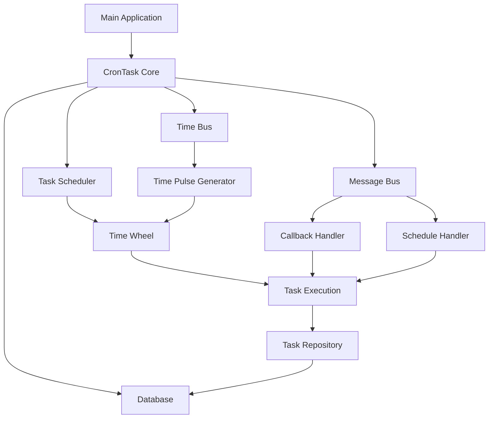
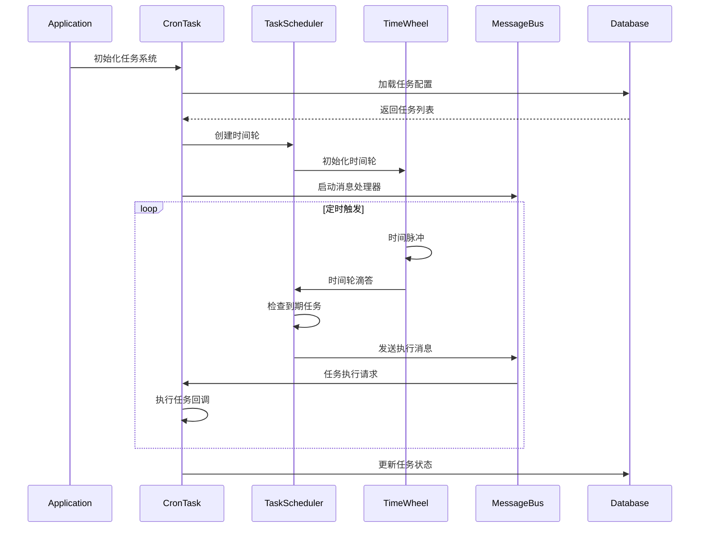
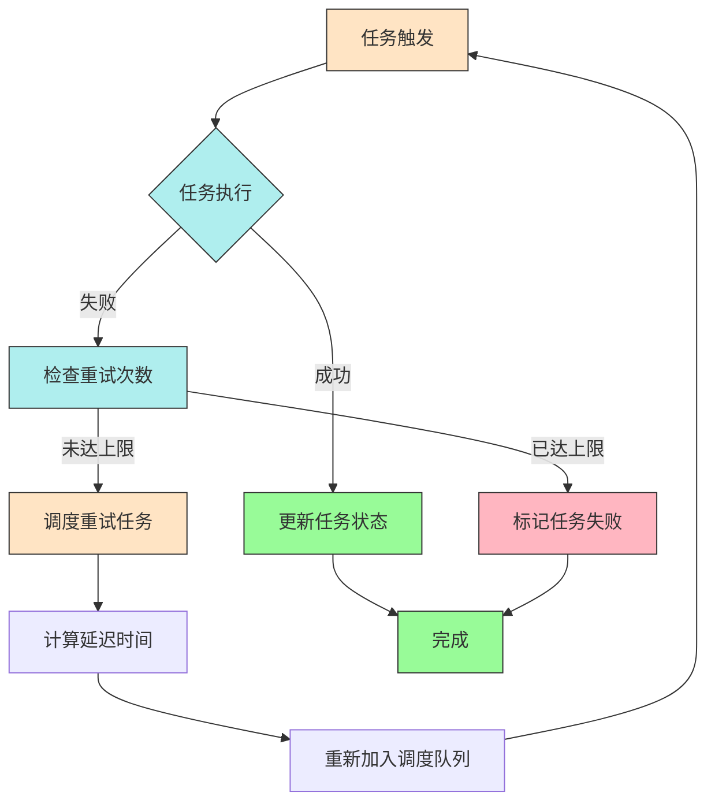

# CronTask - Rust 定时任务调度系统

CronTask 是一个基于 Rust 开发的高性能定时任务调度系统，支持基于时间轮算法的任务调度、重试机制、任务持久化等功能。

## 功能特性

- **高性能时间轮算法**：基于时间轮实现高效的任务调度
- **任务重试机制**：支持任务失败后的自动重试
- **消息驱动架构**：采用消息总线模式实现模块解耦
- **异步处理**：基于 Tokio 实现全异步处理
- **任务持久化**：支持任务状态的持久化存储
- **灵活配置**：支持多种任务配置参数

## 核心模块

### 1. 任务引擎 (Task Engine)
负责任务的定义、存储和管理，包含任务模型和调度逻辑。

### 2. 调度器 (Scheduler)
基于时间轮算法实现高效的任务调度，支持精确到毫秒级的调度。

### 3. 消息总线 (Message Bus)
采用发布/订阅模式实现模块间通信，确保系统解耦和高内聚。

### 4. 时间总线 (Time Bus)
提供时间脉冲信号，驱动时间轮和其他时间相关组件。

### 5. 核心模块 (Core)
系统核心逻辑，包括任务调度、回调处理、数据库操作等。

## 系统架构和流程

### 模块调用关系



### 任务调度流程



### 任务执行与重试流程



## 核心组件详解

### CronTask 核心管理器
负责整个任务调度系统的协调和管理，包含：
- 任务调度器实例
- 内部状态管理
- 数据库连接
- 消息总线和时间总线

### 时间轮调度器
基于时间轮算法实现高效的任务调度：
- 支持毫秒级精度
- 分层时间轮设计
- 高效的任务插入和删除

### 消息总线系统
采用发布/订阅模式实现模块解耦：
- 支持多种消息类型（调度、取消、执行、重载等）
- 异步消息处理
- 广播机制确保消息可靠传递

### 回调处理机制
处理任务执行和重试逻辑：
- 任务执行回调
- 失败重试机制
- 任务状态更新

## 配置说明

系统主要配置项：
- `reload_interval_ms`: 任务重新加载间隔（毫秒）
- `max_schedule_days`: 最大调度天数
- `tick_mills`: 时间轮滴答间隔（毫秒）
- `total_slots`: 时间轮总槽数

## 使用方法

1. 配置数据库连接
2. 设置任务参数
3. 启动应用
4. 系统自动加载并调度任务

## 测试

运行测试:
```bash
cargo test
```

运行特定模块测试:
```bash
cargo test time_bus_test
```

## 依赖

- tokio: 异步运行时
- chrono: 时间处理
- sqlx: 数据库操作
- log: 日志系统
- futures: 异步编程支持